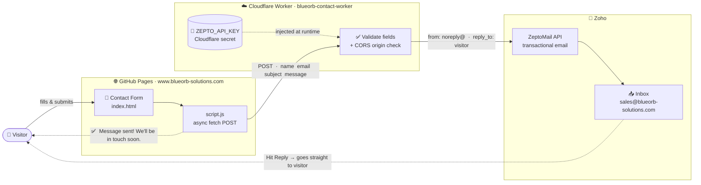

# BlueOrb Solutions — Architecture

## Contact Form Flow

> Visitor submits the form → Cloudflare Worker validates & relays → email lands in the Zoho inbox.
> Replying in Zoho Mail goes straight back to the visitor (via Reply-To).

---

## Key Files

| What you want to change | File to edit |
|-------------------------|--------------|
| Worker URL (browser side) | `config.js` |
| Destination / sender email, CORS | `worker/wrangler.toml` → `wrangler deploy` |
| ZeptoMail API key | `wrangler secret put ZEPTO_API_KEY` (never stored in a file) |
| Site content / styling | `index.html` / `styles.css` / `script.js` → PR → merge |

---

## Decisions

See [`docs/decisions/`](docs/decisions/) for Architecture Decision Records (ADRs).
