# BlueOrb Solutions — Architecture Overview

> This document explains how the website is built, deployed, and how the contact
> form works end-to-end. All diagrams are rendered automatically on GitHub.

---

## 1. Component Map — What lives where

---

## 2. Contact Form — Step-by-step submission flow

---

## 3. Deployment Pipeline — How code goes from local to production

```mermaid
flowchart LR
    DEV["💻 Local Dev\nnpx serve\nlocalhost:3000"]

    subgraph GIT["Git Workflow"]
        direction TB
        FB["Feature Branch\nfeature/xyz"]
        PR["Pull Request\nReview on GitHub"]
        MAIN["main branch"]
        FB --> PR --> MAIN
    end

    subgraph AUTODEPLOY["Automatic on merge to main"]
        direction TB
        GA["GitHub Actions\ndeploy.yml"]
        ARTIFACT["Pages Artifact\n(static files)"]
        PROD["🌐 Production\nwww.blueorb-solutions.com"]
        GA --> ARTIFACT --> PROD
    end

    subgraph WORKER_DEPLOY["Manual — Cloudflare Worker"]
        direction TB
        WRANGLER["wrangler deploy\n(run from /worker)"]
        CF["☁️ Cloudflare Edge\nblueorb-contact-worker"]
        WRANGLER --> CF
    end

    DEV -- "git push" --> GIT
    MAIN --> AUTODEPLOY
    MAIN -- "cd worker &&\nwrangler deploy" --> WORKER_DEPLOY
```

---

## 4. Configuration Map — What to edit and where

---

## 5. Security Boundaries

```mermaid
flowchart LR
    subgraph PUBLIC["🌍 Public — anyone can see"]
        HTML["index.html"]
        CSS["styles.css"]
        JS["script.js"]
        CFG["config.js\n(Worker URL only)"]
        TOML_PUB["worker/wrangler.toml\n(email addresses, CORS)"]
    end

    subgraph PRIVATE["🔐 Private — never exposed"]
        KEY["ZEPTO_API_KEY\nCloudflare encrypted secret"]
    end

    subgraph EDGE["☁️ Cloudflare Edge — server-side only"]
        ENV["env.ZEPTO_API_KEY\nenv.FROM_EMAIL · env.TO_EMAIL\nenv.ALLOWED_ORIGIN"]
    end

    KEY -. "injected at runtime\nnever sent to browser" .-> ENV
    TOML_PUB -. "deployed as env vars\nnever sent to browser" .-> ENV
```

