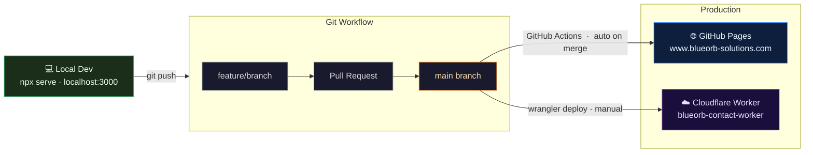
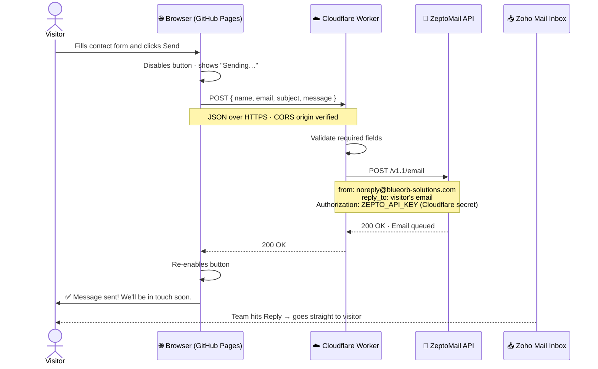

# BlueOrb Solutions — Website

**Live site:** [www.blueorb-solutions.com](https://www.blueorb-solutions.com)

Static business website hosted on GitHub Pages, with a serverless contact form backed by Cloudflare Workers and ZeptoMail.

---

## Deployment Pipeline

Code travels from a local machine to production via a Git PR workflow.

---

## Contact Form Flow

When a visitor submits the form, no email client opens — the message is delivered silently server-side.

---

## Tech Stack

| Layer | Technology |
|-------|-----------|
| Hosting | GitHub Pages (free, auto-deploy via GitHub Actions) |
| DNS | Squarespace DNS → A records + CNAME |
| Contact form backend | Cloudflare Workers (serverless edge function) |
| Email delivery | ZeptoMail (Zoho transactional email API) |
| Email inbox | Zoho Mail — `sales@blueorb-solutions.com` |
| API key storage | Cloudflare encrypted secret (never in any file) |

---

## Further Reading

- [ARCHITECTURE.md](ARCHITECTURE.md) — detailed technical reference + Architecture Decision Records
