# BlueOrb Solutions — Website

**Live site:** [www.blueorb-solutions.com](https://www.blueorb-solutions.com)

Static business website hosted on GitHub Pages, with a serverless contact form backed by Cloudflare Workers and ZeptoMail.

---

## Deployment Pipeline

Code travels from a local machine to production via a Git PR workflow.

```mermaid
flowchart LR
    LOCAL["💻 Local Dev\nnpx serve · localhost:3000"]

    subgraph GIT ["Git Workflow"]
        direction TB
        FB["feature/branch"] --> PR_["Pull Request"] --> MAIN["main branch"]
    end

    subgraph PROD ["Production"]
        direction TB
        PAGES["🌐 GitHub Pages\nwww.blueorb-solutions.com"]
        WORKER["☁️ Cloudflare Worker\nblueorb-contact-worker"]
    end

    LOCAL -- "git push" --> GIT
    MAIN  -- "GitHub Actions  ·  auto on merge" --> PAGES
    MAIN  -- "wrangler deploy  ·  manual"        --> WORKER

    style LOCAL   fill:#1a2e1a,stroke:#27ae60,color:#e8ffee
    style FB      fill:#1a1a2e,stroke:#7f8c8d,color:#ddd
    style PR_     fill:#1a1a2e,stroke:#7f8c8d,color:#ddd
    style MAIN    fill:#1a1a2e,stroke:#e67e22,color:#ffe0b0
    style PAGES   fill:#0d1f3c,stroke:#4a9eff,color:#e8f4ff
    style WORKER  fill:#1a0f3c,stroke:#9b59b6,color:#e8dfff
```

---

## Contact Form Flow

When a visitor submits the form, no email client opens — the message is delivered silently server-side.

---

## Tech Stack

| Layer | Technology |
|-------|-----------|
| Hosting | GitHub Pages (free, auto-deploy via GitHub Actions) |
| DNS | Squarespace DNS → A records + CNAME |
| Contact form backend | Cloudflare Workers (serverless edge function) |
| Email delivery | ZeptoMail (Zoho transactional email API) |
| Email inbox | Zoho Mail — `sales@blueorb-solutions.com` |
| API key storage | Cloudflare encrypted secret (never in any file) |

---

## Further Reading

- [ARCHITECTURE.md](ARCHITECTURE.md) — detailed technical reference + Architecture Decision Records
