# BlueOrb Solutions — Architecture

> Full technical reference for how the site is built, deployed, and how the contact form works.
> See [`README.md`](../README.md) for a quick overview.

---

## 1 · Deployment Pipeline

How code travels from a local machine to production.

```mermaid
flowchart LR
    LOCAL["💻 Local Dev\nnpx serve · localhost:3000"]

    subgraph GIT ["Git Workflow"]
        direction TB
        FB["feature/branch"] --> PR_["Pull Request"] --> MAIN["main branch"]
    end

    subgraph PROD ["Production"]
        direction TB
        PAGES["🌐 GitHub Pages\nwww.blueorb-solutions.com"]
        WORKER["☁️ Cloudflare Worker\nblueorb-contact-worker"]
    end

    LOCAL -- "git push" --> GIT
    MAIN  -- "GitHub Actions  ·  auto on merge" --> PAGES
    MAIN  -- "wrangler deploy  ·  manual"        --> WORKER

    style LOCAL   fill:#1a2e1a,stroke:#27ae60,color:#e8ffee
    style FB      fill:#1a1a2e,stroke:#7f8c8d,color:#ddd
    style PR_     fill:#1a1a2e,stroke:#7f8c8d,color:#ddd
    style MAIN    fill:#1a1a2e,stroke:#e67e22,color:#ffe0b0
    style PAGES   fill:#0d1f3c,stroke:#4a9eff,color:#e8f4ff
    style WORKER  fill:#1a0f3c,stroke:#9b59b6,color:#e8dfff
```

| Step | How |
|------|-----|
| Site changes | Feature branch → PR → merge to `main` → GitHub Actions auto-deploys |
| Worker changes | `cd worker && wrangler deploy` (manual, from any branch) |
| API key rotation | `wrangler secret put ZEPTO_API_KEY` (never stored in a file) |

---

## 2 · Contact Form — Runtime Flow

What happens, step by step, when a visitor submits the contact form.

---

## Key Files

| What you want to change | File to edit |
|-------------------------|--------------|
| Worker URL (browser side) | `config.js` |
| Destination / sender email, CORS origin | `worker/wrangler.toml` → `wrangler deploy` |
| ZeptoMail API key | `wrangler secret put ZEPTO_API_KEY` |
| Site content / styling | `index.html` / `styles.css` / `script.js` → PR → merge |

---

## Architecture Decision Records

See [`decisions/`](decisions/) for the reasoning behind each major choice.

| # | Decision |
|---|----------|
| [ADR-001](decisions/001-github-pages-hosting.md) | GitHub Pages for static hosting |
| [ADR-002](decisions/002-zeptomail-contact-form.md) | ZeptoMail for transactional email |
| [ADR-003](decisions/003-cloudflare-worker-middleware.md) | Cloudflare Worker as serverless middleware |
